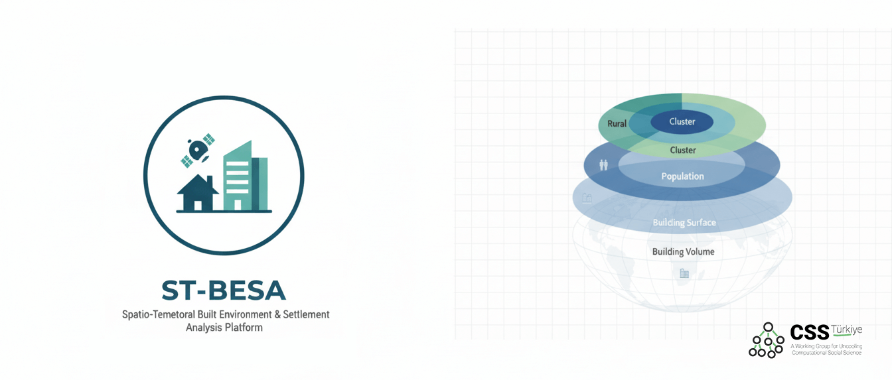

# ST-BESA: Spatio-Temporal Built Environment & Settlement Analysis Platform



<div align="center">

[](https://colab.research.google.com/github/cssturkiye/st-besa/blob/main/ST_BESA_Colab.ipynb)
[](#-about-the-paper)
[](https://opensource.org/licenses/MIT)
[](https://www.python.org/downloads/)

*ST-BESA: A low-code platform for spatio-temporal settlement analytics*

</div>

> We will update this README with a DOI link once available.

## Overview

ST-BESA is a platform for computing built-environment indicators and settlement classification metrics for administrative units. It integrates Google Earth Engine with JRC Global Human Settlement Layer (GHSL) datasets to provide:

- **Building Volume** (m³)
- **Building Surface** (m²)
- **Population Count**
- **BVPC** (Building Volume Per Capita)
- **BSPC** (Building Surface Per Capita)
- **SMOD Classification** (Degree of Urbanization L1/L2)


## Features

| Feature | Description |
|---------|-------------|
| Multi-year analysis | Compute indicators for years 1975–2030 (5-year intervals) |
| Instant year switching | Switch between years without re-computation |
| Auto/Manual scaling | Percentile-based or user-defined visualization ranges |
| High-resolution export | 600 DPI map layers for publication |
| Excel reports | Multi-sheet workbooks with data dictionary |

## Supported Countries

ST-BESA supports administrative boundary analysis for the following countries:

| Flag | Country | Status | ADM1 (Province) | ADM2 (District) | Source |
|:----:|---------|:------:|-----------------|-----------------|--------|
| 🇩🇪 | Germany | ✅ Ready | State / City (L4, L7) | District / Gemeinde (L4–11) | Kontur |
| 🇬🇷 | Greece | ✅ Ready | Regional Unit (L6) | Municipality (L9) | Kontur |
| 🇳🇱 | Netherlands | ✅ Ready | Municipality (L10) | Settlement (L10–14) | Kontur |
| 🇹🇷 | Türkiye | ✅ Ready | Province | District | OCHA COD |
| 🇧🇪 | Belgium | 🔧 In Progress | — | — | — |
| 🇫🇷 | France | 🔧 In Progress | — | — | — |
| 🇮🇹 | Italy | 🔧 In Progress | — | — | — |
| 🇬🇧 | United Kingdom | 🔧 In Progress | — | — | — |
| 🇪🇺 | Other EU Countries | 📋 Planned | — | — | — |
| 🌍 | Global South Expansion | 📋 Planned | — |Focus on data-scarce regions| — |

> **Contributions Welcome!** To add a new country, see the [Boundary Configuration Guide](docs/BOUNDARY_CONFIG.md).

## Quick Start

### Local Installation

```bash
git clone https://github.com/cssturkiye/st-besa.git
cd st-besa
pip install -r requirements.txt
python app.py
```

### Google Colab

Click the **Open in Colab** badge above to run ST-BESA in the cloud without local installation.

## Documentation

| Document | Description |
|----------|-------------|
| [Installation Guide](docs/INSTALLATION.md) | Setup instructions and authentication |
| [User Guide](docs/USER_GUIDE.md) | How to use the application |
| [Architecture](docs/ARCHITECTURE.md) | Technical design and module structure |
| [Boundary Configuration](docs/BOUNDARY_CONFIG.md) | Adding new countries/datasets |

## Data Sources

| Dataset | Provider | License |
|---------|----------|---------|
| Administrative Boundaries | UN OCHA / Kontur | CC BY 4.0 |
| Building Volume/Surface | JRC GHSL (GHS_BUILT_V/S) | CC BY 4.0 |
| Population | JRC GHSL (GHS_POP) | CC BY 4.0 |
| Settlement Model | JRC GHSL (GHS_SMOD) | CC BY 4.0 |

## Requirements

- Python 3.11+
- Google Cloud Project with Earth Engine API enabled
- See [requirements.txt](requirements.txt) for dependencies

## Citation

If you use ST-BESA in your research, please cite:

```bibtex
@article{stbesa2026,
  title={ST-BESA: An Open-Source Low-Code Platform for Global Spatio-Temporal Settlement Analytics Using Google Earth Engine},
  author={Polat, Evrim Yılmaz and Polat, Evrim Çağın},
  journal={SoftwareX},
  year={2026},
  note={Under Review}
}
```

## License

This project is licensed under the MIT License. See [LICENSE](LICENSE) for details.

Data sources are subject to their respective licenses (CC BY 4.0 for JRC GHSL and OCHA datasets).
